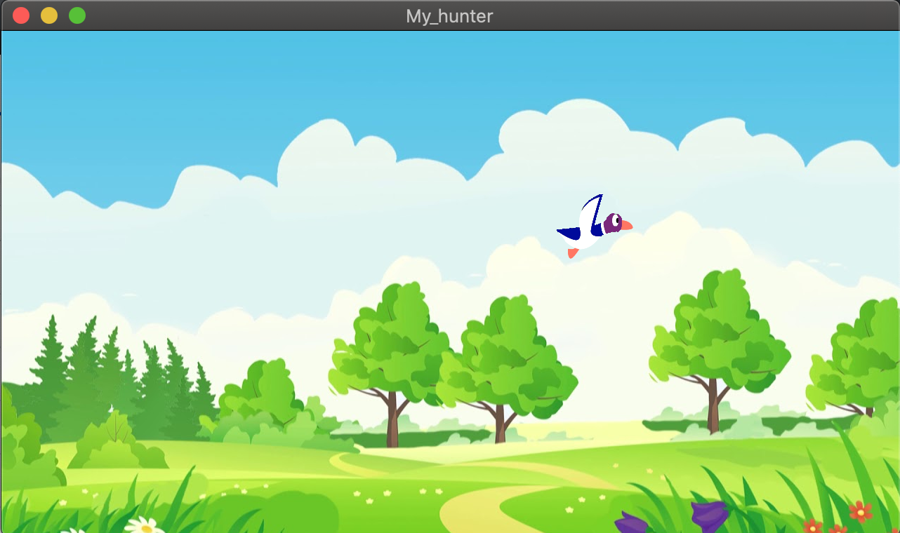

# MUL_my_hunter_2018
Réalisation d'un jeu en C (lib SFML) type DuckHunt

## BIENVENUE SUR LE HUNTER

DESCRIPTION : 
- Lancez le jeu et suivez les instructions.
- Tirez sur le canard pour le faire réapparaitre
- Quittez le jeu avec la touche 'Q'.

UTILISATION : 
./my_hunter

## WELCOME ON THE RUNNER

DESCRIPTION : 
- Start the game and follow the instructions.
- Shot the duck using your mouse left click
- Quit thanks to 'Q'.

USAGE : 
./my_hunter

**************

### Quick Preview

